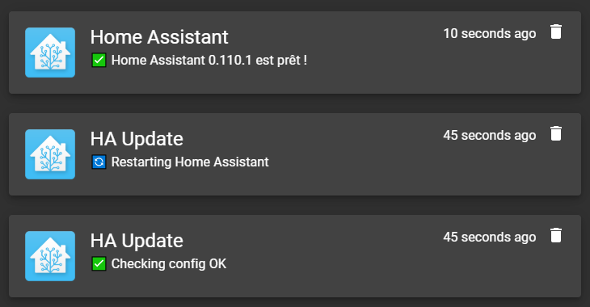

## Update

Bash scripts to update my HA instance with notification.
It output a log file in the `$HADIR` in a `$(date +%F_%H-%M)-update-log.txt` format 
(old one is removed when re-running this script).

My HA is installed in a Python virtual environment (venv) following
[this article](https://www.home-assistant.io/docs/installation/raspberry-pi/).

[Mon article sur l'installation](https://www.scrample.xyz/installation-de-home-assistant-sous-ubuntu-18-04/)  
[Et la suite](https://www.scrample.xyz/maj-python-pour-home-assistant/)

I run this script using 
[Shell Command integration](https://www.home-assistant.io/integrations/shell_command/).


### Gotify notifications

The notification are send using cURL commands. 
To use this one, it require to set the URL and the token in the script.
Please also check the HA directory and it's virtual environnement location.

```bash
HADIR="/home/homeassistant/.homeassistant"
HAVENV="/srv/homeassistant/bin/activate"
GOTIFYURL="https://gotify.blablabla.mu"
GOTIFYTOKEN="Az3rTy" # Your token here
```


[Mon article sur Gotify](https://www.scrample.xyz/gotify-service-de-notifications/)


### Telegram notifications

The notifications are send using 
[telegram-notify](https://github.com/NicolasBernaerts/debian-scripts/tree/master/telegram) 
with a custom config file located in `$HADIR/.telegram-notify.conf`.


